# Port IO Assessment
---

## Credentials
| Service | Email | Password/Host |
|---------|-------|----------|
| Port | `port+edwardoboh@savannahtech.io` | `********` |
| Atlasian | `edwardoboh.atlassian.net` | `edwardoboh.atlassian.net` |

## Exercise #1
### 1. JQ patterns that will extract the following information:

#### a. The current replica count:
<!-- > Pattern: -->
```bash
.status.replicas
```

i.  The `.status` field in the pattern navigates to the status object and then, <br >
ii. The `.replicas` field extracts the current replica count property, representing the actual number of replicas that currently exist in the cluster.
<!-- > While we could also get the same information from the `.spec.replicas` field, the `.status.replicas` pattern represents the actual number of replicas that currently exist in the cluster, regardless of their readiness state. This is the most accurate representation of the "current replica count" as requested in your question. -->

#### b. The deployment strategy:
<!-- >Pattern: -->
```bash
.spec.strategy.type
```
i.    The `.spec` field in the pattern navigates to the specification object, <br >
ii.   The `.strategy` field then accesses the strategy configuration under the spec object, after which <br >
iii. The `.type` field then extracts the deployment strategy type (`RollingUpdate` for this deployment).
> To get the full strategy object, use `.spec.strategy`.

#### c. The “service” and “environment” label of the deployment concatenated with a hyphen (-) in the middle:
<!-- >Pattern: -->
```bash
.metadata.labels.service + "-" + .metadata.labels.environment
```
i.    The `.metadata` field in the pattern  navigates to the metadata object, <br >
ii.   Then, `.labels` accesses the labels object,  <br >
iii.  Then `.service` and `.environment` extract the respective label values. <br >
iv.   The `+` operator concatenates these strings with a hyphen (`-`) in between. <br >

### 2. Extract all issue IDs for all subtasks, into an array:
<!-- >Pattern: -->
```bash
[.fields.subtasks[].key]
```
i.    The pattern `.fields` accesses the fields object, <br >
ii.   Then `.subtasks` accesses the subtasks array field. <br >
iii.  The `[]` operator iterates through each element in the subtasks array, and <br >
iv.   The `.key` field in the pattern extracts the key field from each subtask object. <br >
v.    The outer `[...]` brackets collect all the extracted keys into a single array, rather than outputting them as separate values.


## Exercise #2
**A.** After installing Port’s GitHub app which creates the Repository blueprint
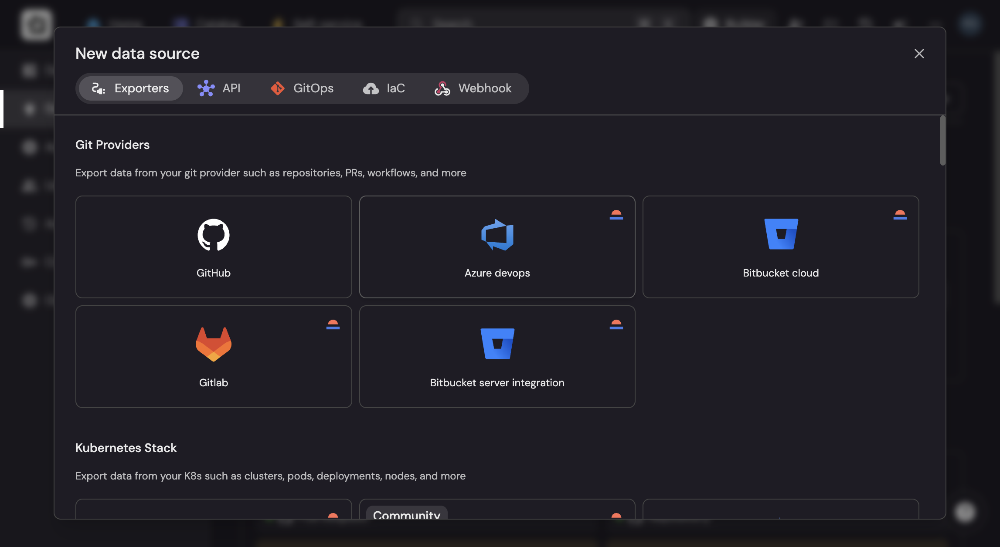

<br />

**B.** I proceeded to install Port's Ocean integration for Jira, using the `Scheduled - GitHub Workflow` option. With the instructions displayed on the modal, i was able to set up the repository secrets and the GitHub workflow.
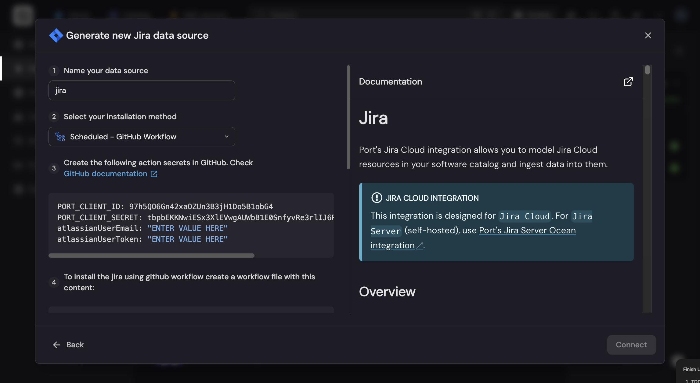

<br />

Below is a screenshot showing the GitHub workflow used in to install the Jira Integration
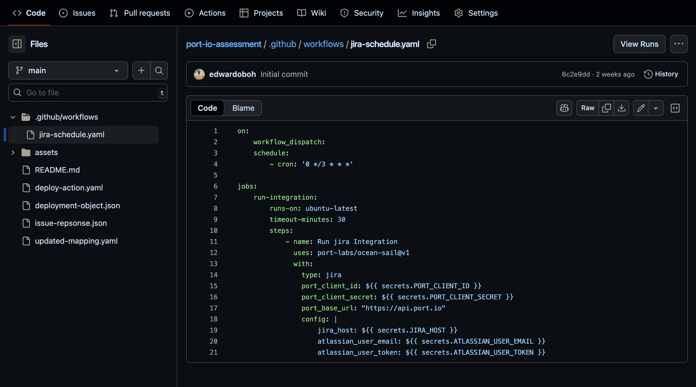

<br />

After successfully integrating Jira and GitHub, we can now see both integrations in Data sources page in Port, under the Exporters category.
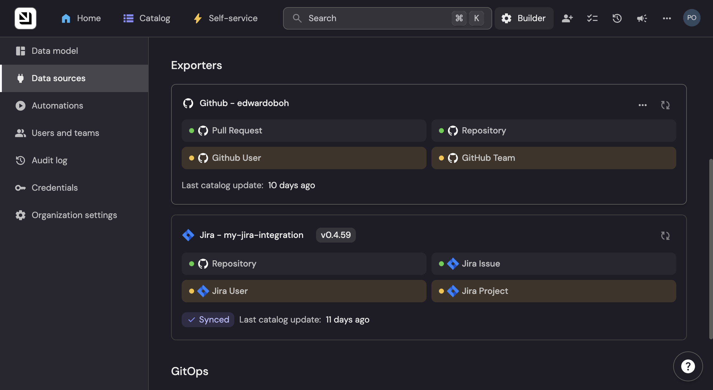

<br />

**C.** I then created a Jira issue configured with Jira components whose names exactly match the GitHub repositories we want to link. Since a single Jira issue can include multiple components, I decided to link two components to the Issue.
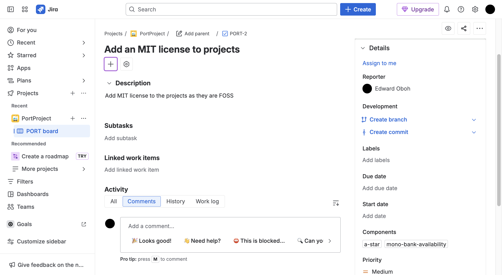
> The instructions were very helpful in setting up my free Jira account  

<br />

Also, below is a screenshot showing the created components, matching my GitHub repositories.
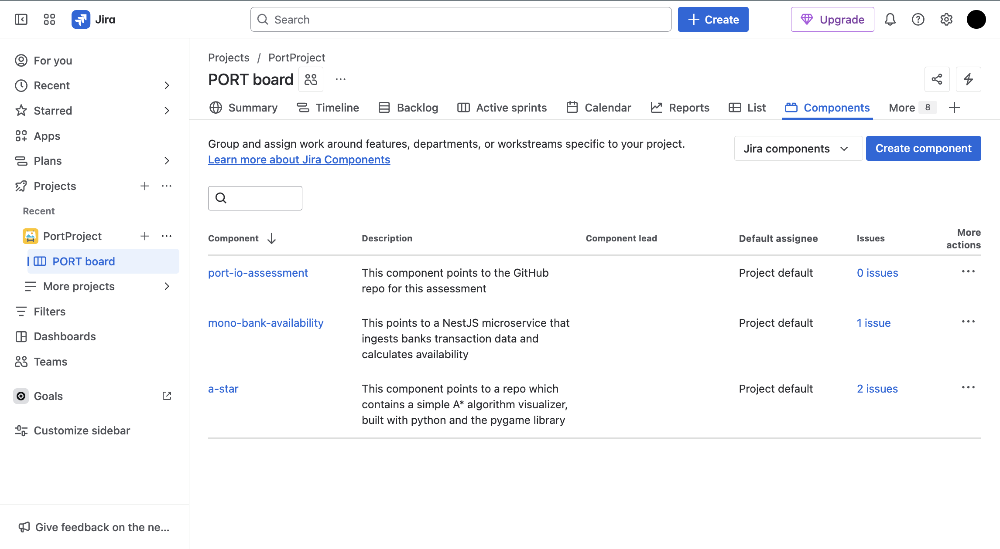

<br />

**D.** I then updated the Jira integration mapping so that each component on an issue is used as the join key to the corresponding Repository entity:
```yaml
resources:
#   - kind: user ...
#   - kind: project ...
  - kind: issue
    selector:
      query: 'true'
      jql: (statusCategory != Done) OR (created >= -1w) OR (updated >= -1w)
    port:
      entity:
        mappings:
          identifier: .key
          title: .fields.summary
          blueprint: '"jiraIssue"'
          properties: {}
          relations:
            project: .fields.project.key
            parentIssue: .fields.parent.key
            subtasks: .fields.subtasks | map(.key)
            jira_user_assignee: .fields.assignee.accountId
            jira_user_reporter: .fields.reporter.accountId
            assignee:
              combinator: '"or"'
              rules:
                - property: '"jira_user_id"'
                  operator: '"="'
                  value: .fields.assignee.accountId // ""
                - property: '"$identifier"'
                  operator: '"="'
                  value: .fields.assignee.email // ""
            reporter:
              combinator: '"or"'
              rules:
                - property: '"jira_user_id"'
                  operator: '"="'
                  value: .fields.reporter.accountId // ""
                - property: '"$identifier"'
                  operator: '"="'
                  value: .fields.reporter.email // ""
            repository: .fields.components | map(.name) # SEE HERE
```
In the `issue` resource kind above, i added a `repository` identifier under the `relations` field (i.e `.port.entity.mappings.relations`) and equated it to `.fields.components | map(.name)`.
> What this does is to extract the component names from the Jira issue component(s) array and returns them as a simple list. We could have also made use of the patter `[.fields.components[].name]` as they produce the same result.

<br />

Below is a screenshot showing the output from the Jira Integration mapping modal after running a test on the updated mapping

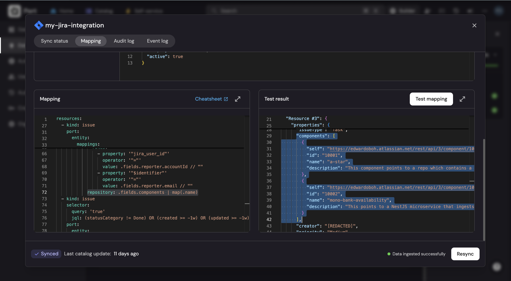
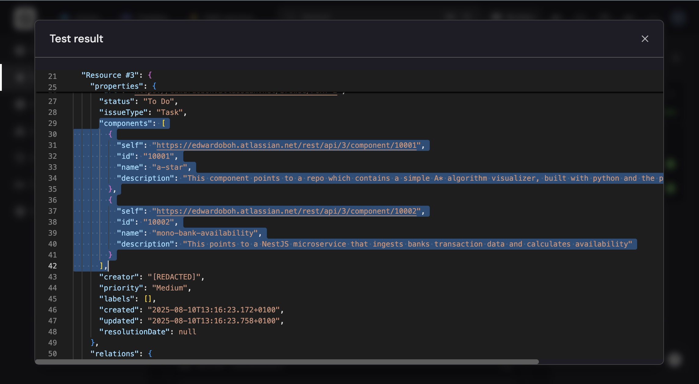

<br />

After re-syncing, either by running the workflow manually or waiting for the cron job, we can now see repositories whose names match the component names on the Jira issue.
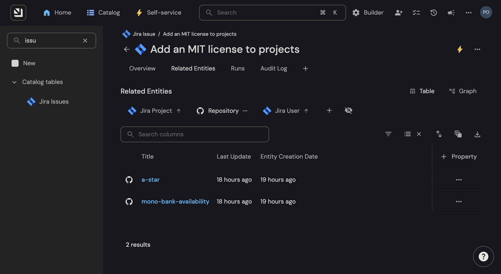
In the image, we can see that the issue is automatically related to two GitHub repositories.


## Exercise #3
I first created an `Aggregation` property which calculates the number of Open PRs using the relationship between the Repository and Pull Request blueprints. Below is the JSON configuration of the property:
```json
{
  "aggregationProperties": {
    "open_pr_count": {
      "title": "Open PR Count",
      "icon": "GitPullRequest",
      "type": "number",
      "description": "This fields counts the number of Open PRs in a Repository",
      "target": "githubPullRequest",
      "query": {
        "combinator": "and",
        "rules": [
          {
            "property": "status",
            "operator": "=",
            "value": "open"
          }
        ]
      },
      "calculationSpec": {
        "func": "count",
        "calculationBy": "entities"
      }
    }
  },
}
```
With this property holding the number of Open PRs, I then used the following JSON rule for the ScoreCard, to match the required specification:

```json
{
  "identifier": "prCountCard",
  "title": "PR Score",
  "levels": [
    {
      "color": "paleBlue",
      "title": "Basic"
    },
    {
      "color": "bronze",
      "title": "Bronze"
    },
    {
      "color": "silver",
      "title": "Silver"
    },
    {
      "color": "gold",
      "title": "Gold"
    }
  ],
  "rules": [
    {
      "identifier": "isGold",
      "title": "Below 5",
      "level": "Gold",
      "query": {
        "combinator": "and",
        "conditions": [
          {
            "property": "open_pr_count",
            "operator": "<",
            "value": 5
          }
        ]
      }
    },
    {
      "identifier": "isSilver",
      "title": "Below 10",
      "level": "Silver",
      "query": {
        "combinator": "and",
        "conditions": [
          {
            "property": "open_pr_count",
            "operator": "<",
            "value": 10
          }
        ]
      }
    },
    {
      "identifier": "isBronze",
      "title": "Below 15",
      "level": "Bronze",
      "query": {
        "combinator": "and",
        "conditions": [
          {
            "property": "open_pr_count",
            "operator": "<",
            "value": 15
          }
        ]
      }
    }
  ]
}
```
I experimented by opening five(5) PRs on this repository [a-star repo](https://github.com/edwardoboh/a-star)
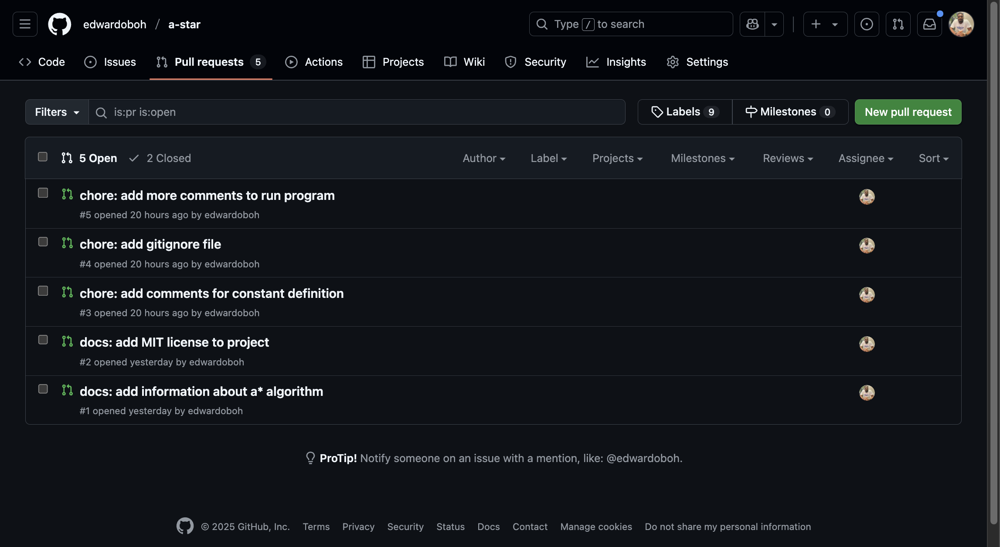

And twelve(12) PRs on this repository [mono-bank-availability repo](https://github.com/edwardoboh/mono-bank-availability)
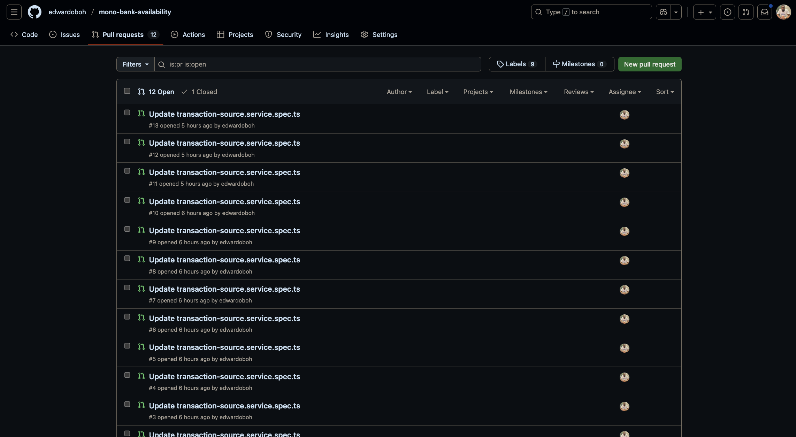

<br />

After re-syncing we can now see the Scoreboard with the proper badges. See image below:
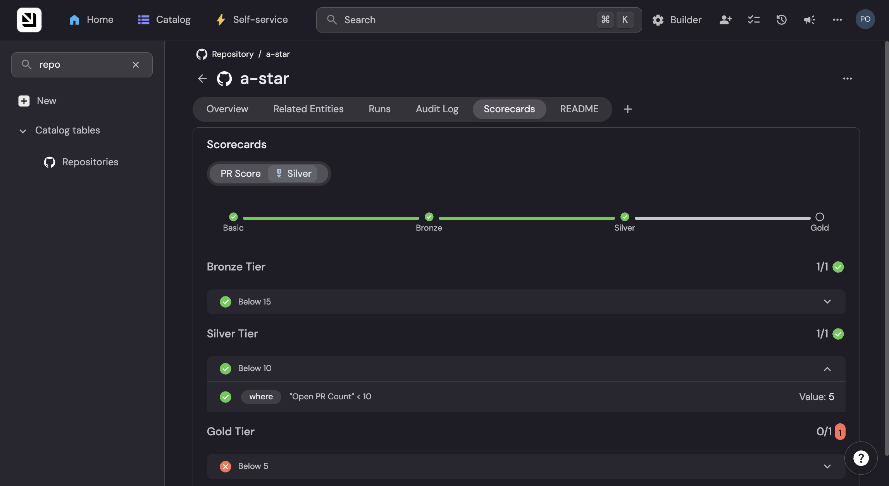

See Result for all repositories below
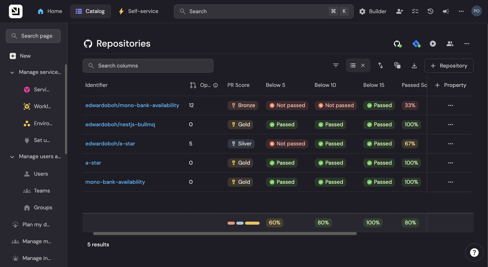


## Exercise #4
When a self-service action remains in the "In progress" status indefinitely, it indicates a breakdown in the **`Port -> GitHub -> Port`** communication loop.

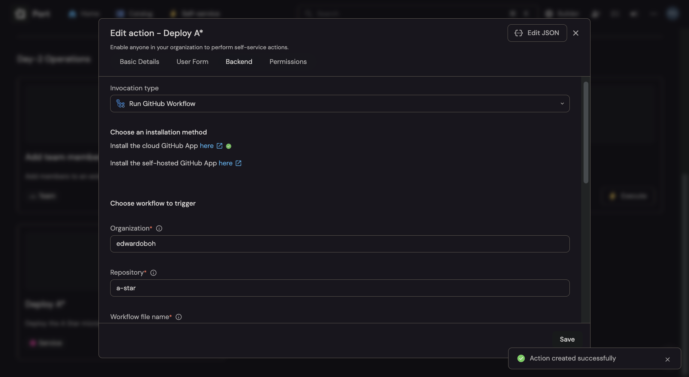

I implemented a similar integration as shown above. Based on my experience, if re-syncing the GitHub App integration doesn’t address the issue, it is most likely at one of four critical points:

1. **Port-to-GitHub trigger failure**: The GitHub action isn't reaching GitHub at all
2. **GitHub workflow configuration issues**: The workflow can't accept or process the trigger
3. **Network/Infrastructure problems**: Communication path are blocked. i.e If using a `self-hosted integration` or a **Self Runner** for the workflow
4. **GitHub-to-Port status reporting failure**: Workflow runs but can't update port

> Below are the steps I would take in troubleshooting and resolving the issue.

---

## **1: Verifying the Foundation**

### **Step 1: Validate Basic Configuration**
My first debugging step is always to verify the fundamentals, as configuration errors account for most of integration failures in my experience.

1. Navigate to GitHub, in the Applications section of the organization or account Settings.
2. Verify that the GitHub App is installed and configured with the right access to the GitHub repository where the workflow resides.

> Is it possible that the App though installed might not have the sufficient access to the repository, or that the App is in fact installed in the wrong organization.

### **Step 2: Check Action Configuration**
Below is the `invocationMethod` section of the Action configuration i used for my integration:
```json
{
  "invocationMethod": {
    "type": "GITHUB",
    "org": "edwardoboh",
    "repo": "a-star",
    "workflow": "deploy-action.yaml",
    "workflowInputs": {
      "environment": "{{ .inputs.environment.identifier }}",
      "port_context": "{{ .entity.identifier }}"
    },
    "reportWorkflowStatus": true
  },
}
```

Some common mistakes here are:
- Typo in the organization/Account name or the Repository name
- Referencing the wrong workflow file or a typo in the name of the workflow file
- The actual workflow file might be in the wrong directory/path in the repository


## **2: Investigating GitHub Workflow**

### **Step 3: Workflow Trigger Analysis**
For my integration, I implemented a GitHub Action Mock Deployment to a specific environment based on the user's input (see here: [deploy-action.yaml](https://github.com/edwardoboh/a-star/blob/master/.github/workflows/deploy-action.yaml)) and a potential issue is workflow input handling.

For example, the below workflow is problematic as it has to external trigger support:
```yaml
on:
  push:
    branches: [main]
  pull_request:
```

The accurate pattern should be:
```yaml
on:
  workflow_dispatch:
    inputs:
      port_context:
        required: true  # or false, depending on the workflow 
        type: string
```

The debugging approach here would be to:
- Check if `workflow_dispatch` trigger exists
- Verify that the input parameter definitions match Port's output format. In my integration, i made use of the below output pattern, a very much simplified version of the default:
```json
{
  "environment": "{{ .inputs.environment.identifier }}",
  "port_context": "{{ .entity.identifier }}"
}
```
Compare what is being sent from Port to what is being accepted in the workflow and ensure that the data type on the workflow has been configured properly.
- Finally, it also helps to test the workflow manually, in order to isolate "port-specific" issues


## **3: Diagnosing Infrastructure & Network**

### **Step 4: Self-Hosted Runner Connectivity**
Network issues are a potential cause of indefinite "In progress" status, especially with self-hosted integration, using self runners. A failed connectivity could cause the workflow to run successfully but fail to report back to Port.

To test connectivity from the self-hosted runner to Port's API, I would run the following command:

```bash
curl -v -X POST https://api.getport.io/v1/actions/runs \
  -H "Content-Type: application/json" \
  -H "Authorization: Bearer test" \
  -d '{"testing": "connection"}'
```
A 401 Unauthorized response confirms network path from runner to Port API and back. A Timeout or connection refused response indicates no path.

For a failed connectivity test, my troubleshooting checklist will involve checking:
- Firewall rules blocking outbound HTTPS
- Corporate proxy interfering with webhooks
- DNS resolution issues
- Runner instance failures/restarts

This debugging approach does two important things. We begin with configuration validation to catch basic setup errors like wrong permissions or naming mistakes. Next, we test communication pathways between Port and GitHub, verifying connectivity and data formats.